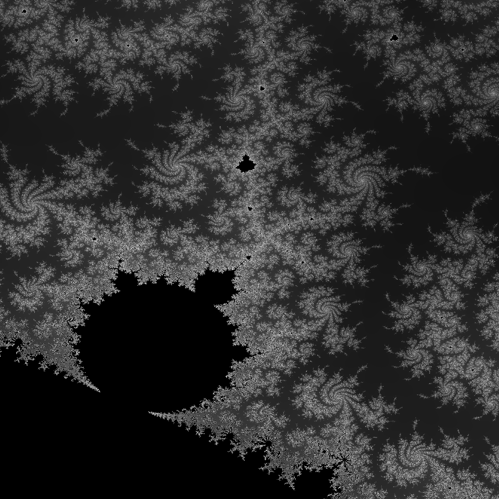

## Inspiration: 
I developed this project out of my passion for fractals and mathematics. It was my first experience programming for the GPU, which presented some challenges. Through this project, I gained valuable hands-on experience with the Unity engine, honed my C# programming skills, and learned about GPU programming using HLSL.

## Mandelbrot:
```c
int mandelbrotVal(float cx, float cy)
{    
    float r = 0.0;
    float i = 0.0;
    
    for (int j = 0; j <= iterations; j++)
    {
        float r2 = r*r;
        float i2 = i*i;
        
        if (r2+i2 > 4.0)
        {
            return j;
        }
        
        float rTemp = r;
        r = (r2-i2)+cx;
        i = (2.0*rTemp*i)+cy;
    }
    
    return 0;
}
```

<div class="text-center m-3"></div>

This function is key to figuring out whether a point belongs to the Mandelbrot set. I've implemented several optimizations that enable the program to run smoothly at 60 frames per second. To handle imaginary numbers, we use two floating-point numbers: one for the real part and another for the imaginary part. We also simplify some mathematical operations, like squaring complex numbers, to minimize the calculations the GPU needs to perform for each iteration. Optimizing this function is essential for achieving great performance, as it runs simultaneously for each of the 2,073,600 pixels on a standard Full HD monitor.


## Unexpected Setbacks:
My current GPU doesn't support 64-bit floating point operations, which caused some pixelation when I zoomed in on the Mandelbrot set. This is due to floating point errors. While there are ways to address this issue, they involve using arbitrary precision arithmetic, which significantly slows down calculations on the GPU and can lead to a major drop in performance.


<div class="text-center"></div>