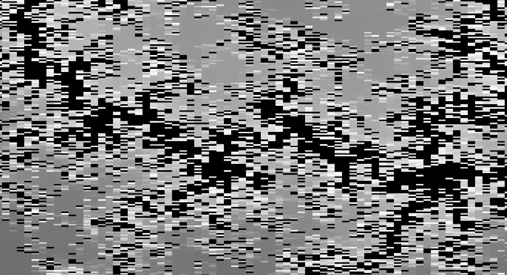

## Inspiration
I created this project because I love fractals and math. I have never programmed for the GPU so this was no easy task. By making this application, I was able to practice using Unity engine, C# programming and GPU programming with HLSL.

## Mandelbrot 
```c
int mandelbrotVal(float cx, float cy)
{    
    float r = 0.0;
    float i = 0.0;
    
    for (int j = 0; j <= iterations; j++)
    {
        float r2 = r*r;
        float i2 = i*i;
        
        if (r2+i2 > 4.0)
        {
            return j;
        }
        
        float rTemp = r;
        r = (r2-i2)+cx;
        i = (2.0*rTemp*i)+cy;
    }
    
    return 0;
}
```
This function is the main driver for determining if a point is in the mandelbrot set. There are many optimizations that allow the program to run in real-time at 60fps. Imaginary numbers are represented as two floating point numbers, one for the real part and one for the imaginary part. Some math operations - such as squaring complex numbers - are expanded out to reduce the number of computations that the GPU has to calculate for each iteration. Optimizing this function is crucial for good performance as this function is ran in parallel for each of the 2,073,600 pixels in a standard Full HD monitor.

## Unexpected Setbacks
The GPU that I own does not support 64 bit floating point operations. This resulted in some pixelation as I zoomed in further into the mandelbrot set. There are some work-arounds to this problem but it requires arbitrary precision arithmetic. This will take much longer to calculate on the GPU and performance will drop by at least a factor of 4.

