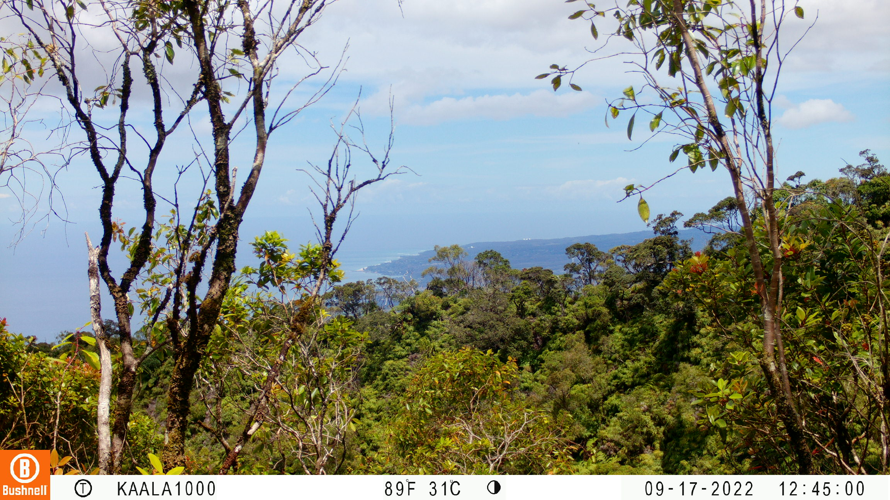
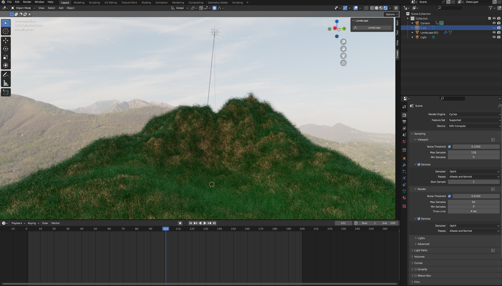

## Overview:
I collaborated with a partner to develop a machine learning model that can identify whether an image is foggy or clear. This project is significant for tracking Hawaii's climate over time. Traditional fog sensors can be bulky, costly, and not easily accessible to everyone. Our tool offers a solution for individuals with large collections of trail camera images, allowing them to efficiently sort their photos into foggy or clear categories.

<div class="text-center m-2"></div>

## Tools:
I learned how to use Blender, a 3D graphics tool, to create a set of images that included both foggy and clear scenes. This project involved producing over 100 images, which took several hours to complete due to the detailed fog effects I used to ensure they looked as realistic as possible. The fog effects were created using a physically based path-tracer for realistic lighting. After creating these images, I trained a machine learning model using this data and then tested how well it performed with real-world images.

<div class="text-center m-2"></div>

```python
# load features
df_train = pd.DataFrame(pd.read_csv("features-generated.txt"))
df_test = pd.DataFrame(pd.read_csv("features.txt"))

X_train = []
y_train = df_train["category"].to_numpy()

# transform features
for i in df_train["location"].unique():
    site = df_train[df_train["location"] == i]
    X = site.iloc[:, [4, 5, 6, 7, 8, 9, 10]]
    X = StandardScaler().fit_transform(X)
    X_train.append(X)
X_train = np.concatenate(X_train, axis=0)

# train model
model = LogisticRegression()
model.fit(X_train, y_train)

# test model
for i in df_test["location"].unique():
    site = df_test[df_test["location"] == i]
    X_test = site.iloc[:, [4, 5, 6, 7, 8, 9, 10]]
    X_test = StandardScaler().fit_transform(X_test)
    y_true  = site["category"].to_numpy()
    auroc = roc_auc_score(y_true, model.predict_proba(X_test)[:,1])
```

## Results:
The logistic regression model trained with the data set of images generated with Blender yielded an average AUROC of 0.74. In other words, the model learned some of the main features of foggy images and was able to predict foggy images in real world data without having any real world data in its training set. Isn't that cool!